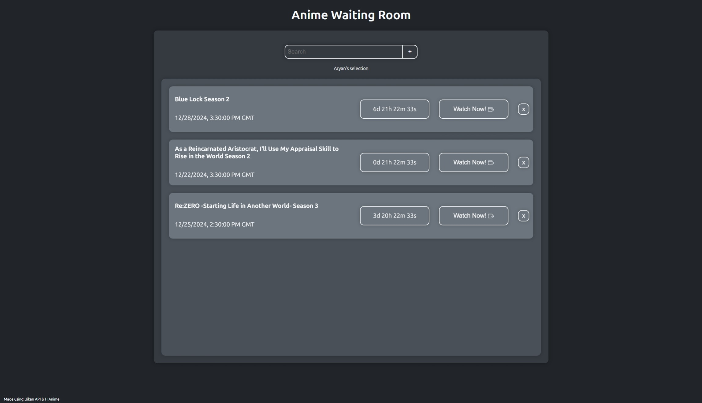
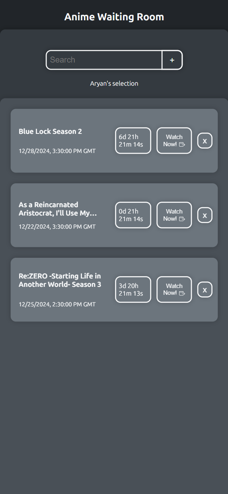

# Anime Waiting Room

A clean, responsive website to track countdowns for airing anime episodes. Built to make it easy for anime fans to keep track of their favorite shows in real-time!

**:warning: Important Note:** Files could be outdated, keep up to date with newest version on the [website](https://www.l145.be/anime-waiting-room/) itself.

**New**: Improved error handling, added MyAnimeList link to each anime, fixed timer, next episode release date adjusted to user's local time.

## Desktop view


## Mobile view


# Features
- **Real-time Countdown**: Displays the time remaining until the next episode.
- **JikanAPI Integration**: Fetches accurate anime release schedules.
- **Dynamic Watch Links**: Quickly jump to watch your favorite anime.
- **Multi-Anime Support**: Track multiple anime countdowns at the same time.
- **Dynamic Caching**: Store your anime inputs locally and automatically load them in every time you re-open the site.

# Tech Stack
- **Frontend**: HTML, CSS, JavaScript
- **API**: JikanAPI (https://jikan.moe)

# How to Use
## Online
https://www.l145.be/anime-waiting-room/

## Locally
1. Clone the repo:
   ```bash
   git clone https://github.com/legelff/anime-waiting-room.git
   cd anime-waiting-room

2. Open index.html in your browser.
Search for anime and start tracking countdowns instantly!

# Acknowledgments
- **JikanAPI** for providing anime data.
- **HiAnime** for links to anime!
- **MyAnimeList** for link to anime info.
